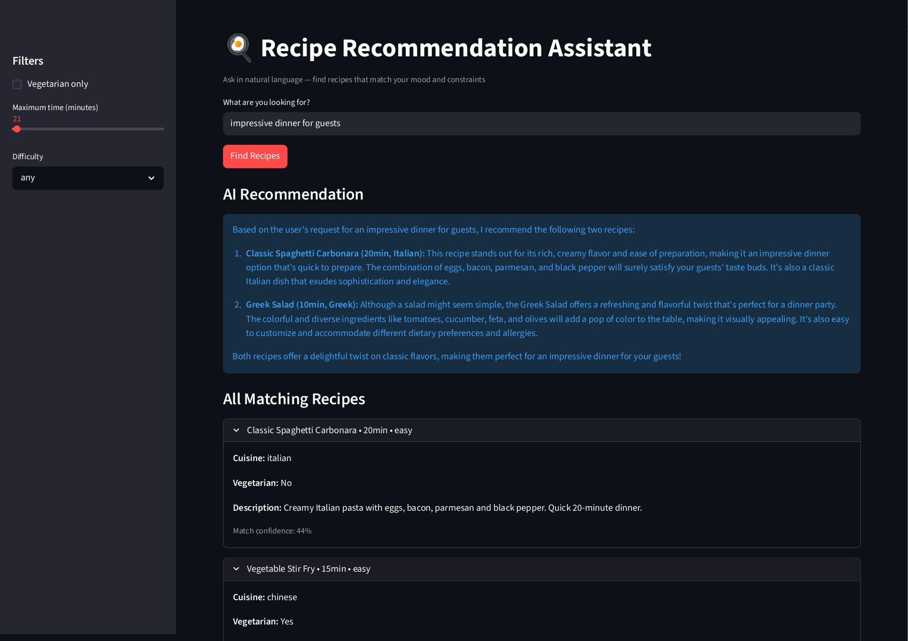

# Recipe Recommendation Assistant

> Natural language recipe search with grounded AI recommendations — combining semantic understanding with hard filters and graceful empty-state handling.



## Problem

Recipe platforms have a search problem. Users describe what they want in natural language ("something quick and healthy", "comfort food for a lazy Sunday"), but databases match rigid categories or exact ingredients. The result is poor recommendations that ignore intent — or filter combinations that return zero results with no explanation, causing users to abandon the search.

This system understands natural language intent, applies hard constraints from sidebar filters, and explicitly tells users when filters are too restrictive.

## Features

- **Semantic search** that understands intent, not just keywords
- **Metadata filtering** for vegetarian, time, cuisine, and difficulty
- **AI-generated recommendations** with reasoning grounded in retrieved recipes
- **Confidence scores** displayed per recipe match
- **Graceful empty-state UI** when filters return no matches
- **Sidebar controls** for interactive filter adjustment

## Tech Stack

- **Python 3.11+**
- **sentence-transformers** — embedding generation
- **ChromaDB** — vector storage with metadata filtering
- **Groq API** — LLM inference for recommendations
- **Streamlit** — interactive UI with sidebar filters

## Setup

```bash
git clone the repo
cd recipe-recommender

conda create -n recipe-app python=3.11
conda activate recipe-app

pip install -r requirements.txt
export GROQ_API_KEY="your-key-here"

streamlit run recipe_app.py
```

## Usage

```python
from recipe_app import build_collection, search_recipes, generate_answer

collection = build_collection()

results = search_recipes(
    collection,
    query="something quick and healthy",
    filters={"$and": [
        {"vegetarian": {"$eq": True}},
        {"time_minutes": {"$lt": 30}}
    ]}
)

recommendation = generate_answer("something quick and healthy", results)
print(recommendation)
```

## Key Engineering Decisions

### Hybrid Search Pattern
Pure semantic search returns relevant results but ignores hard constraints — a vegetarian user might receive bacon recipes because "comfort food" embeds similarly across diets. Pure filter-based search ignores intent — exact matches on cuisine and time miss the underlying user goal.

The system combines both: filters enforce non-negotiable constraints (dietary requirements, time available) while semantic search ranks within the filtered set by relevance to user intent.

### Empty-State Handling
When filters eliminate all candidates, the system tells users explicitly: "No matching recipes found. Try relaxing your filters." This is a small but critical UX pattern — most search systems show empty results with no explanation, causing users to abandon rather than refine.

### Confidence Scores
Each result displays a confidence score derived from vector distance. Users can distinguish strong matches from weak ones, building trust in the recommendation system rather than treating it as a black box.

## Known Limitations

- **Small recipe corpus** (8 demo recipes) limits semantic diversity — production would need 100+ recipes minimum
- **Filter combinations** can be over-restrictive (vegetarian + 20 minutes + medium difficulty often returns nothing)
- **Cultural concepts** like "comfort food" are loosely captured by the embedding model — recommendations on these queries are weaker than on concrete attribute queries
- **No user personalisation** — recommendations are based on query alone, not user history

## What I Learned Building This

Three insights from this project:

1. **Filter restrictiveness is a UX problem, not just a data problem.** When zero results return, the user needs guidance, not a blank page.
2. **Cultural concepts embed weakly.** "Comfort food" returned poorer results than concrete queries like "20-minute pasta" — semantic search has limits around culturally loaded terms.
3. **Confidence scores build trust.** Showing match strength explicitly is better than hiding the underlying ranking.
